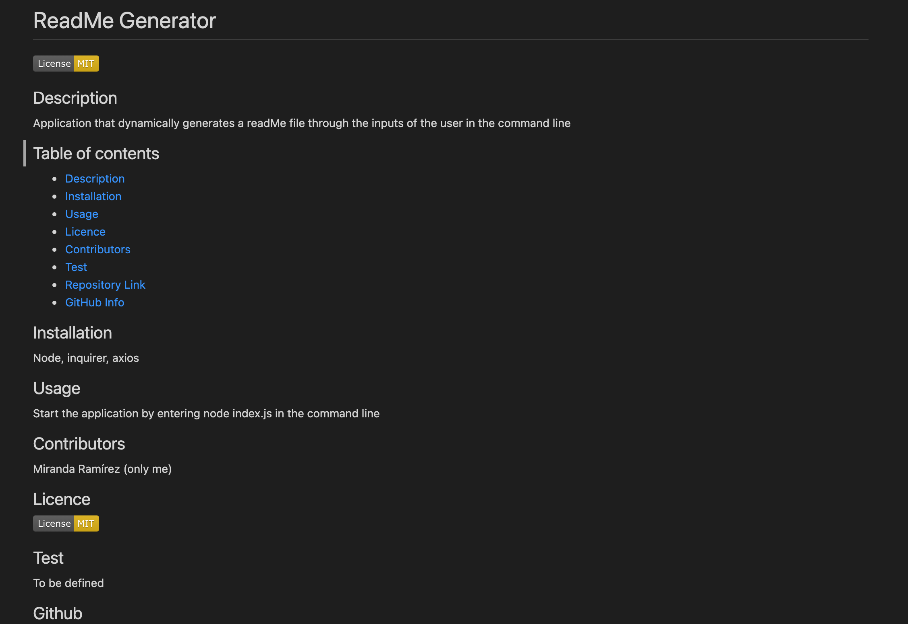

# Professional README Generator

## The task
When creating an open source project on GitHub, it’s important to have a high-quality README for the app. This should include what the app is for, how to use the app, how to install it, how to report issues, and how to make contributions&mdash;this last part increases the likelihood that other developers will contribute to the success of the project. 

The objective of the task is to create a command-line application that dynamically generates a professional README.md file from a user's input using the Inquirer package. 

## Technologies
Some of the technologies used in the application were:
* Inquirer
* Axios
* Node 
* Asynchronous Functions

## Solution 
The application will is invoked by using the following command:

```bash
node index.js
```

## Walkthrough video:

* Link to walkthrough video: [Link to Video](https://drive.google.com/file/d/1fyeg2D3L6TeJeUTlqD0GUY31FeLjV18m/view?usp=sharing)

## Screenshot of the resulting ReadMe file 



